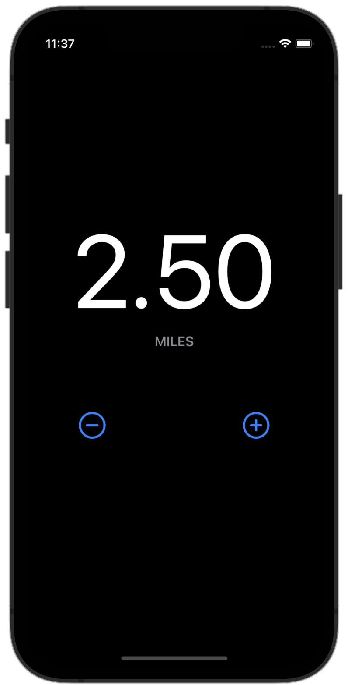
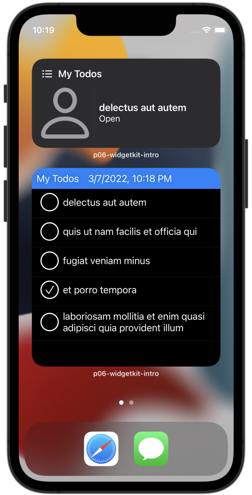
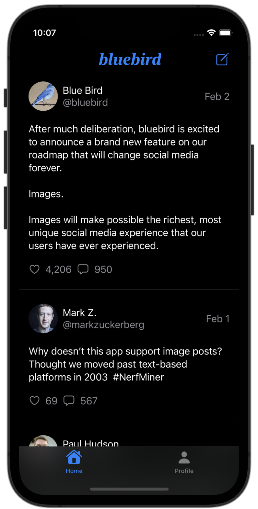
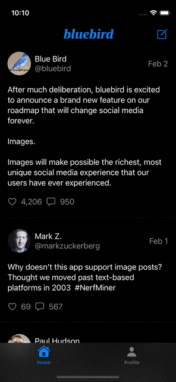
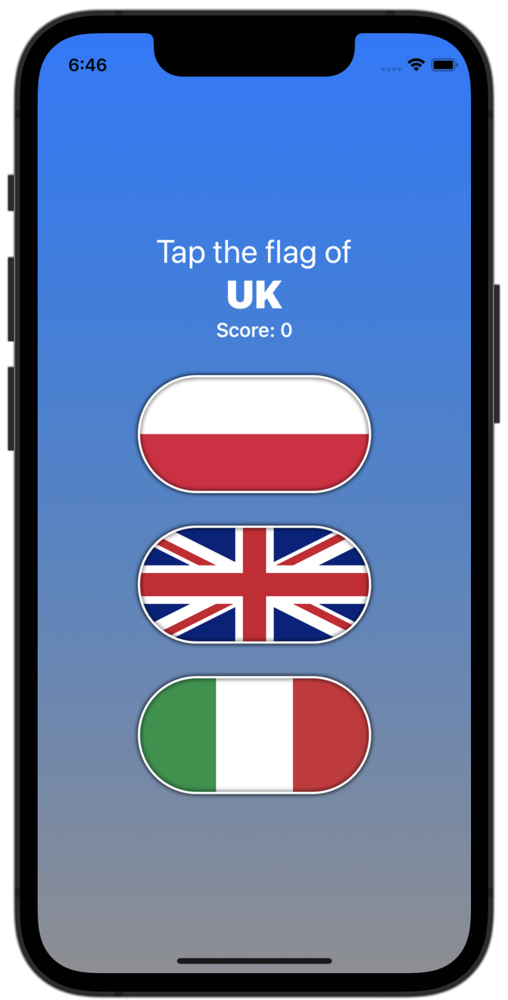
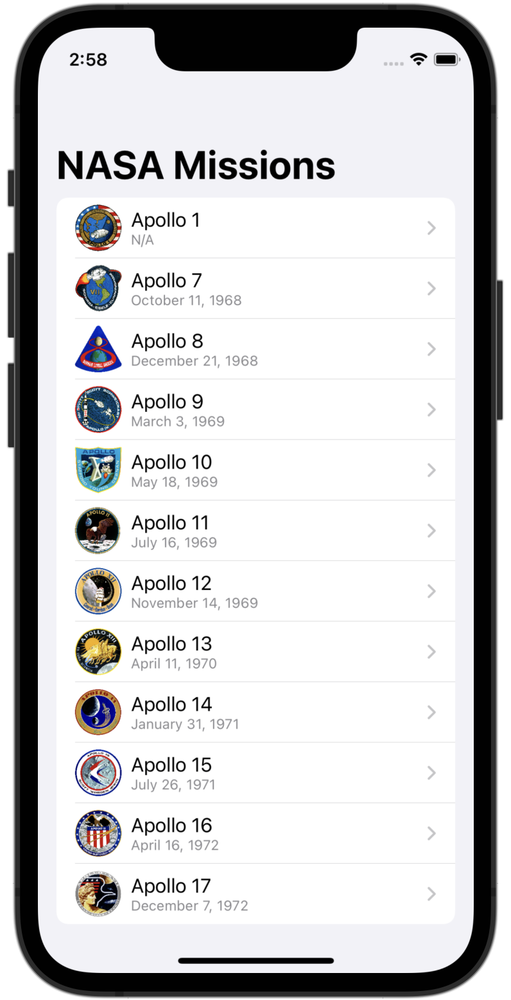
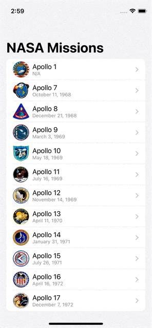
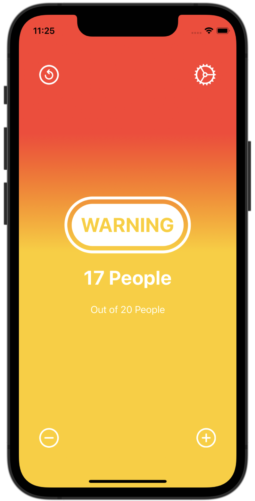

# apprentice-projects-spring22
Central repository for App Team Carolina's Academy Apprenticeship projects in Spring 2022.
 Developed by Peter Wi.

## Screenshots

|Num|Name|Screenshots|Key Points
|--|--|--|--|
|07|[runny](p07-runny)||1.WidgetKit 2.Size Classes 3.Deep Links 4.TimelineProvider
|06|[widget-todo](p06-widgetkit-intro)||1.WidgetKit 2.Size Classes 3.Deep Links 4.TimelineProvider
|05|[bluebird](p05-socialmedia)||1.MVVM Pattern 2.Tab View 3.Codable 4.URLSession
|04|[moodiary](p04-mood-tracker)||1.MVVM Pattern 2.Core Data 3.Color Picker 4.Animation
|03|[flag-game](p03-flag-refactoring)||1.MVVM Pattern 2.State 3.Animation 4.Alert
|02|[apollo](p02-apollo)||1.MVVM Pattern 2.NavigationLink 3.Binding 4.ForEach
|01|[occupancy-tracker](p01-occupancy-tracker)||1.State 2.Gradient 3.Intutive UI

