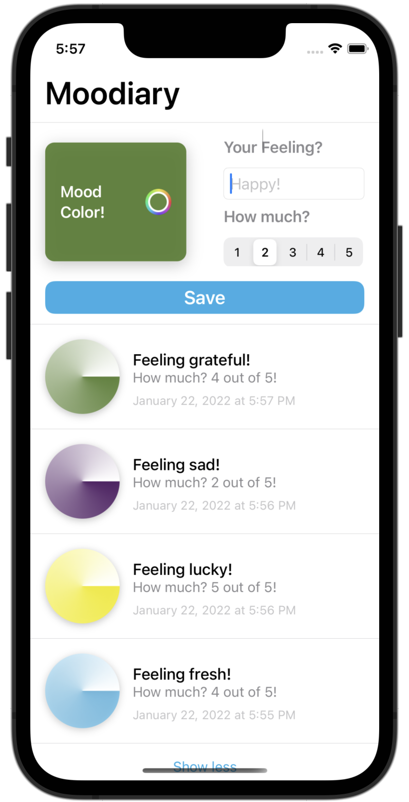
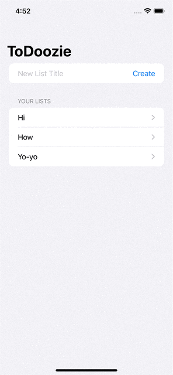

# apprentice-projects-spring22
Central repository for App Team Carolina's Academy Apprenticeship projects in Spring 2022.

## Screenshots

|Num|Name|Screenshots|Key Points
|--|--|--|--|
|04|[moodiary](p04-mood-tracker)||1.MVVM pattern 2.Core Data 3.Color Picker
|03|[flag-game](p03-flag-refactoring)||1.MVVM pattern 2.State 3.Animation
|02|[apollo](p02-apollo)||
|01|[occupancy-tracker](p01-occupancy-tracker)||1.MVVM pattern 2.NavigationLink 3.Binding
|00|[todo](ex00-todo)||1.Sam made it

